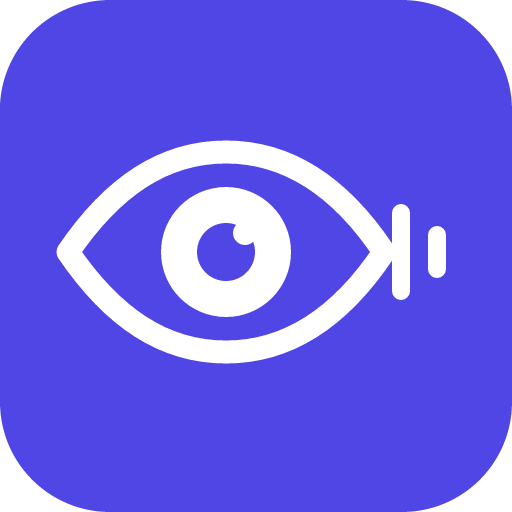
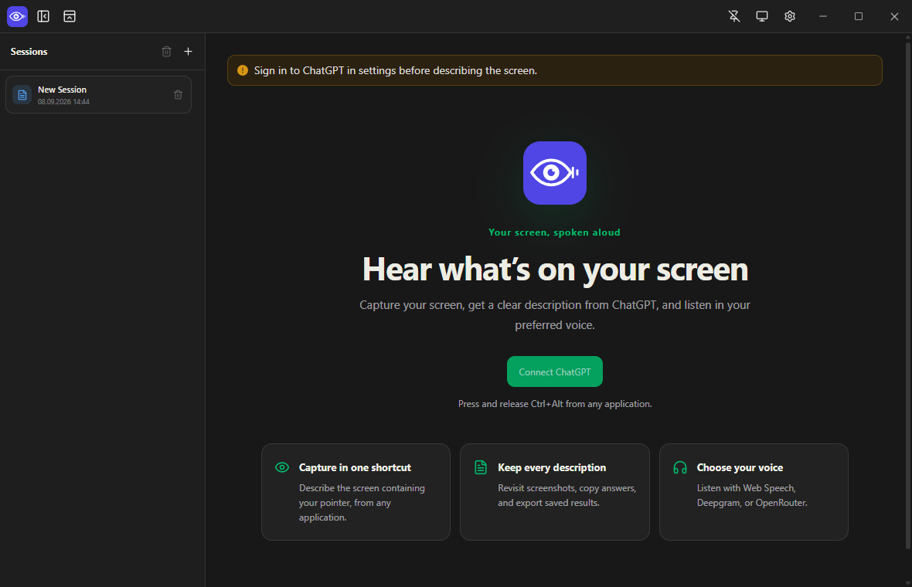
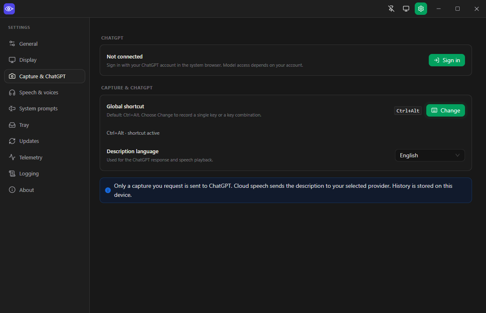

<p align="center">
  
</p>

<h1 align="center">BlindLens</h1>

<p align="center">
  An accessible screen-description application designed for blind and visually impaired people.
</p>

BlindLens captures your screen, describes it with ChatGPT, and reads the result aloud to help blind and visually impaired people understand on-screen content.

<p align="center">
  <a href="https://github.com/bariskisir/BlindLens/actions/workflows/ci.yml"></a>
  <a href="https://github.com/bariskisir/BlindLens/releases/latest"></a>
  <a href="https://github.com/bariskisir/BlindLens/releases"></a>
  <a href="LICENSE"></a>
</p>

<p align="center">
  
  
</p>

---

## Install

1. Download the latest release for your platform from [Releases](https://github.com/bariskisir/BlindLens/releases/latest).
2. Install or extract the package.
3. Run **BlindLens**, sign in to ChatGPT, and choose a speech provider.
4. Press and release **left Ctrl+Alt** to describe the screen under your pointer.

## Development

```bash
git clone https://github.com/bariskisir/BlindLens.git
cd BlindLens
npm run dev
```

Requires Node.js 24+ and npm 11+.

## License

MIT
